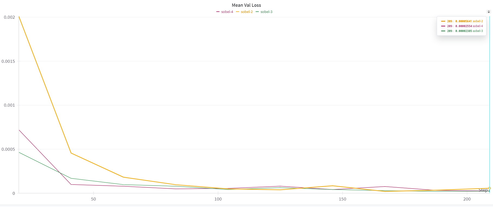
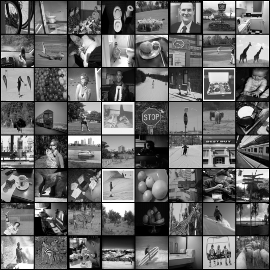
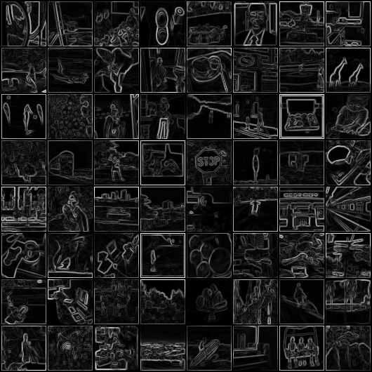
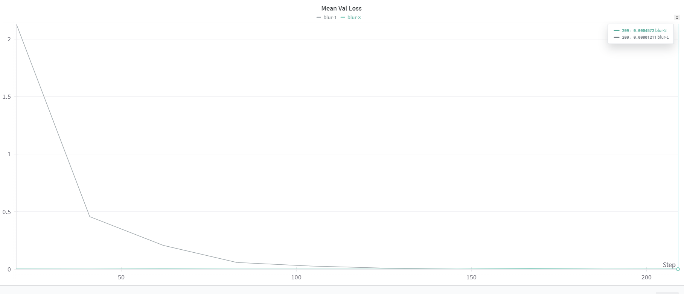
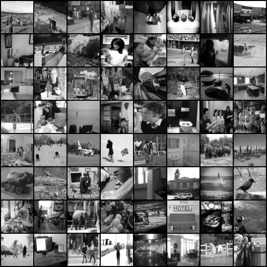
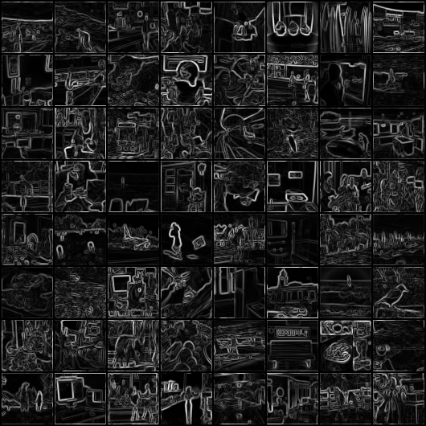
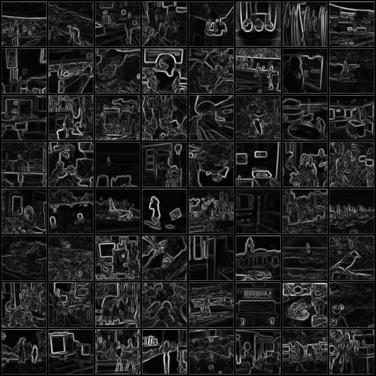

# Sobel Filter using Neural Networks

This repository contains the PyTorch code for the implementation of a sobel filter using neural networks on COCO dataset.

## Index

1. [Understanding the Code](#understanding)
2. [Environment Setup](#setup)
3. [Training](#training)
4. [Testing](#testing)
5. [Results](#results)

## Understanding the Code

```python
function train(input):
    // Step 1: Initialize loss functions, train and val dataset, network  

    // Step 2: Loop over epochs
    for epochs in num_epochs:
      // Step 3: Loop through the dataset
      for batch in input:
          // Step 4: Compute model output
          // Step 5: Compute loss between output and GT
          // Step 6: Backprop and update weights

      // Step 7: Run Steps 3-6 for validation dataset and log the loss
      // Step 8: Save model if the validation loss is lower than that at previous epoch
      // Step 9: Stop training if the decrease in validation loss falls below a certain percentages or epochs are complete

    return model
```

```python
function generateData(input):
    // Step 1: Load COCO dataset
    // Step 2: Compute Sobel filter on each sample 
    // Step 3: Wrap this dataset around a dataloader 

    return dataloader
```

## Environment Setup

In order to build a ```conda``` environment for running our model, run the following command:
```
conda env create -f environment.yml
```

Activate environment using:
```
conda activate sobel
```

## Training 

To train our model, run the following command:
```
CUDA_VISIBLE_DEVICES=ID python train.py
```

You can choose to modify the hyperparameters for training in ```config.json```. Here, you can change various parameters like batch size, number of epochs, image size, learning rate, etc.

In the same file, you can modify the filter you would want to us (variable for that is called ```filter```). The possible values it can take are ```sobel```, ```sym_sobel```, ```avg```, ```blur```, and ```custom```.
You can also add your own custom filter that you want the model to learn in the ```get_gt_values``` function in the ```dataset.py``` file.

## Testing 

To evaluate our model on your test image, place the image in root directory with the name ```test_image.jpg```
The, run the following command:

```
CUDA_VISIBLE_DEVICES=ID python test.py
```

## Results

Here are some of the finding from the evaluation of the trained models.



For the sobel filter, 3 convolutional layers seem to be optimal. We also use ReLU activations between layers.
Performance with 2 and 4 convolutional layers also saturate to a similar loss (both train and validation) but with 3 layers, the convergence is faster. Sobel filter does not work well with just one layer (loss converges to 0.3 which is significantly higher than that of >1 layers).

<p align="center">
  
  
  
</p>



For blurring filter, again 3 convolutional layers lead to faster convergence but eventually, the one layer network reaches a slightly lower loss (both train and validation). This is because effectively we are just applying one convolutional filter to the image which can be learnt by the neural network. A larger network optimizes faster due to its capacity to learn more complex behaviors and since there are multiple ways to represent a filter, it converges faster to a solution.

<p align="center">
  
  
  
</p>

At the boundaries of the output images of sobel filter, we can see artifacts because we will obtain a gradient at the boundary.
Hence, I also tested out a sobel filter that uses wrap boundaries (mirroring) to reduce artifacts at the boundaries of the image. The loss for the model with wrap boundaries is a little higher because the convolutional layers inherently use zero value paddings. This one works well for any number of layers >= 3.

Neural networks (using CNNs) are learning various filters (other than Sobel and blur). So, we provide the feature to manually input a filter in the ```dataset.py``` file and add your filter there. You can then train your model following the training instructions.